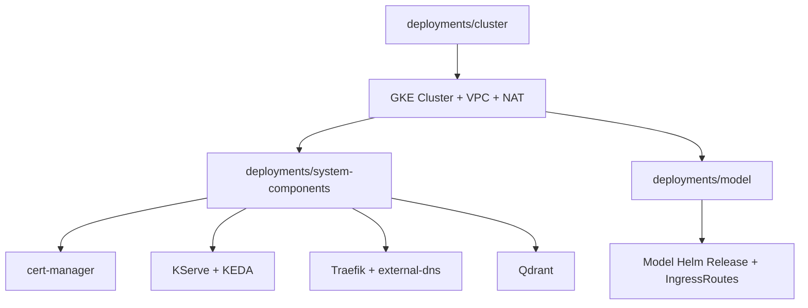

# gke-rag

RAG platform on Google Kubernetes Engine (GKE), with KServe for model serving, Qdrant for vector storage, and Traefik for ingress and routing.

## Core Idea

This repository splits infrastructure into three Terraform stacks so provisioning is predictable and state remains isolated:

1. `cluster`: network + Kubernetes foundation.
2. `system-components`: cluster-level operators and shared platform services.
3. `model`: application/model-facing workloads and gateway routes.

The deployment model is "foundation first, platform second, workloads last".

## Repository Architecture

- `modules/gke`: reusable Terraform module that creates VPC, subnet secondary ranges, Cloud NAT, and a private GKE cluster.
- `deployments/cluster`: instantiates `modules/gke` with environment-specific values.
- `deployments/system-components`: installs cert-manager, KServe, KEDA, Traefik, external-dns, and Qdrant.
- `deployments/model`: deploys the model Helm chart and related service objects.



## How It Works

- Network and Kubernetes control plane are provisioned by the `cluster` stack.
- `system-components` and `model` read cluster connection details (`endpoint`, `ca_certificate`) via Terraform remote state.
- Helm provider in later stacks authenticates against the created GKE cluster using Google access token + remote state outputs.
- Custom Helm charts are stored in-repo under `deployments/system-components/charts` and `deployments/model/charts`.

## Deployment Order

Run these stacks in order:

1. `deployments/cluster`
2. `deployments/system-components`
3. `deployments/model`

Typical workflow per stack:

```bash
terraform init
terraform plan
terraform apply
```

## Important Operational Points

- State is stored in GCS (`sandbox-pblkt-tf-state`) with separate prefixes per stack. Use your bucket for remote state.
- `deployments/system-components` requires `var.cloudflare_token` for DNS and certificate automation. Token should allow to edit your dns zone.
- Current configuration is zonal (`us-central1-c`) and uses hardcoded project/region defaults in locals/providers. Update project/location to use yours instead.
- `system-components` and `model` depend on `cluster` remote state availability before planning/applying.
- GKE module creates a dedicated `qdrant-node-pool` with a taint and label for workload placement.

## Stack Docs

- `deployments/cluster/README.md`
- `deployments/system-components/README.md`
- `deployments/model/README.md`
- `modules/gke/README.md`
